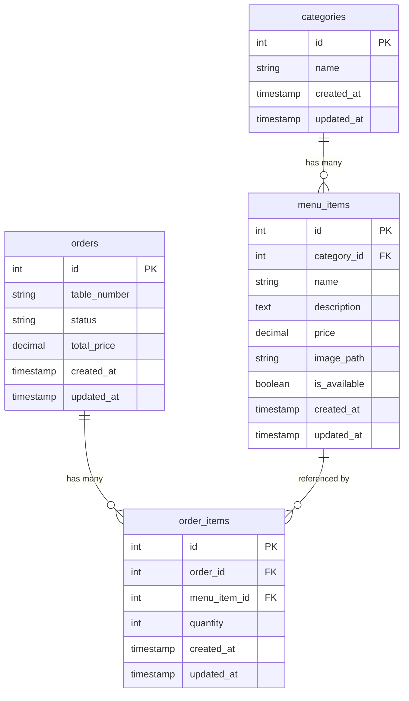

<div align="center">

# 🍽️ Smart Restaurant Ordering System

**A modern, full-stack restaurant management platform built with Laravel**

[](https://laravel.com)
[](https://php.net)
[](https://tailwindcss.com)
[](https://www.sqlite.org)
[](https://pestphp.com)
[](LICENSE)

---

*A rebuilt and modernised version of a group project originally developed with vanilla PHP & MySQL — now powered by the Laravel ecosystem for streamlined restaurant operations.*

[Getting Started](#-getting-started) •
[Features](#-features) •
[Architecture](#-architecture) •
[Usage Guide](#-usage-guide) •
[Testing](#-testing)

</div>

---

## 📖 Table of Contents

- [About the Project](#-about-the-project)
- [Features](#-features)
- [Tech Stack](#-tech-stack)
- [Architecture](#-architecture)
- [Database Schema](#-database-schema)
- [Getting Started](#-getting-started)
  - [Prerequisites](#prerequisites)
  - [Installation](#installation)
  - [Running the Application](#running-the-application)
- [Usage Guide](#-usage-guide)
  - [Admin Panel — Menu Management](#1-admin-panel--menu-management)
  - [Customer Ordering Flow](#2-customer-ordering-flow)
  - [Kitchen Dashboard](#3-kitchen-dashboard)
- [Project Structure](#-project-structure)
- [Route Reference](#-route-reference)
- [Testing](#-testing)
- [License](#-license)

---

## 📋 About the Project

The **Smart Restaurant Ordering System** is designed to digitise and streamline core restaurant workflows — from menu management and contactless customer ordering to real-time kitchen order tracking.

### Background

This project is a **complete rebuild** of a previous group assignment that was originally built with vanilla PHP and a raw MySQL database. The codebase has been migrated to the **Laravel framework** to leverage:

- **Eloquent ORM** for clean, expressive database interactions
- **Blade templating engine** with reusable component architecture
- **Laravel Breeze** for plug-and-play authentication scaffolding
- **Artisan CLI** for migrations, seeding, and developer tooling
- **Pest** for elegant, readable test suites

The result is a maintainable, scalable codebase that follows modern PHP best practices and the MVC architectural pattern.

---

## ✨ Features

### 🔐 Admin Panel — Menu Management (Auth-Protected)
| Feature | Description |
|---------|-------------|
| **Create** | Add new menu items with name, price, category, description, and image |
| **Read** | View all menu items in a sortable, tabular dashboard |
| **Update** | Edit existing item details (name, price, category, availability) |
| **Delete** | Remove items with a confirmation prompt |
| **Auto-Seed Categories** | Automatically creates a default "Main Course" category if none exist |

### 📱 Customer Ordering Flow (Public, No Auth Required)
| Feature | Description |
|---------|-------------|
| **QR-Code Table Access** | Customers scan a QR code that routes to `/table/{table_number}` |
| **Dynamic Menu Display** | Shows only *available* items, grouped by category |
| **Session-Based Cart** | Temporary cart stored in the server session — no login required |
| **Cart Management** | Increment / decrement quantities, or remove items entirely |
| **One-Tap Checkout** | Converts the cart into a persisted `Order` + `OrderItem` records |

### 👨‍🍳 Kitchen Dashboard (Auth-Protected)
| Feature | Description |
|---------|-------------|
| **Live Order Queue** | Displays all orders with `pending` status, sorted oldest-first |
| **Order Detail Cards** | Each card shows the table number, order ID, and itemised breakdown |
| **One-Click Completion** | Staff can mark an order as `completed` to clear it from the board |
| **Manual Refresh** | Refresh button to poll for the latest incoming orders |

---

## 🛠 Tech Stack

| Layer | Technology |
|-------|------------|
| **Framework** | Laravel 13 (PHP 8.3+) |
| **Frontend** | Laravel Blade, Tailwind CSS 3.x, Alpine.js |
| **Database** | SQLite (file-based, zero-config) |
| **Authentication** | Laravel Breeze (session-based) |
| **Build Tool** | Vite 8 with `laravel-vite-plugin` |
| **Testing** | Pest 4 (with `pest-plugin-laravel`) |
| **Code Style** | Laravel Pint |
| **Dev Tooling** | Artisan, Concurrently (parallel server + Vite) |
| **HTTP Client** | Axios |

---

## 🏗 Architecture

The application follows the standard **Laravel MVC** pattern with clear separation of concerns:

```text
┌─────────────────────────────────────────────────────────────────┐
│                       BROWSER / CLIENT                          │
├──────────────────┬──────────────────────┬───────────────────────┤
│   Admin Panel    │  Customer (Public)   │   Kitchen Dashboard   │
│   /menu/*        │  /table/{n}          │   /kitchen            │
│   (Auth Required)│  (No Auth)           │   (Auth Required)     │
├──────────────────┴──────────────────────┴───────────────────────┤
│                      LARAVEL ROUTER (web.php)                   │
│                      + Middleware (auth, verified)              │
├──────────────────┬──────────────────────┬───────────────────────┤
│ MenuItemController│   OrderController   │    OrderController    │
│  (Resource CRUD) │  (Cart + Checkout)   │  (Kitchen + Complete) │
├──────────────────┴──────────────────────┴───────────────────────┤
│                      ELOQUENT ORM (Models)                      │
│           Category ──< MenuItem    Order ──< OrderItem          │
├─────────────────────────────────────────────────────────────────┤
│                      SQLite DATABASE                            │
│           categories | menu_items | orders | order_items        │
└─────────────────────────────────────────────────────────────────┘
```

### 🗃 Database Schema



*Note: The `orders.status` field uses string values: `pending` (default) and `completed`.*

---

## 🚀 Getting Started

### Prerequisites

Ensure you have the following installed on your machine:

| Requirement | Version |
|-------------|---------|
| PHP         | 8.3 or higher |
| Composer    | 2.x |
| Node.js     | 18+ (LTS recommended) |
| npm         | 9+ |

### Installation

1. **Clone the repository**
   ```bash
   git clone https://github.com/skyp3crack/Rebuild-Restaurant-Smart-Ordering-System.git
   cd Rebuild-Restaurant-Smart-Ordering-System/smart-restaurant
   ```

2. **Run the automated setup** (installs dependencies, generates `.env`, runs migrations, and builds assets)
   ```bash
   composer setup
   ```

   <details>
   <summary>Or set up manually step-by-step</summary>

   ```bash
   # Install PHP dependencies
   composer install

   # Copy environment file
   cp .env.example .env

   # Generate application key
   php artisan key:generate

   # Create the SQLite database and run migrations
   touch database/database.sqlite   # Linux/Mac
   # Windows: New-Item database\database.sqlite -ItemType File
   php artisan migrate

   # Install Node.js dependencies
   npm install

   # Build frontend assets
   npm run build
   ```
   </details>

3. **(Optional) Seed the database with a test user**
   ```bash
   php artisan db:seed
   ```

   This creates a default user:
   | Field | Value |
   |-------|-------|
   | Email | test@example.com |
   | Password | password |

### Running the Application

**Quick Start (Recommended)**
Run the server, queue worker, log viewer, and Vite dev server all in one command:

```bash
composer dev
```

| Process | Description | Default URL |
|---------|-------------|-------------|
| server  | `php artisan serve` | http://localhost:8000 |
| queue   | `php artisan queue:listen` | — |
| logs    | `php artisan pail` (live log tail) | — |
| vite    | `npm run dev` (HMR) | http://localhost:5173 |

**Manual Start**

```bash
# Terminal 1 — Laravel dev server
php artisan serve

# Terminal 2 — Vite dev server (hot module replacement)
npm run dev
```

Then open `http://localhost:8000` in your browser.

---

## 📘 Usage Guide

### 1. Admin Panel — Menu Management
1. Navigate to `/login` and sign in (or register a new account).
2. Go to **Manage Menu Items** from the navigation.
3. Click **+ Add New Item** to create a menu entry.
4. Fill in the item name, price, category, description, and optionally upload an image.
5. Use the **Edit** and **Delete** actions on the menu table to manage existing items.

### 2. Customer Ordering Flow
> 💡 **Designed for QR codes:** Generate a QR code that points to `http://your-domain/table/1` (or any table number). Customers scan and start ordering.

1. Access the public menu at `/table/{table_number}` (e.g., `/table/5`).
2. Browse items grouped by category — only available items are shown.
3. Tap **Add** to add items to your cart.
4. Use the `+` / `−` buttons in the floating cart to adjust quantities.
5. Tap **Checkout** to submit the order to the kitchen.
6. A success message confirms the order has been placed.

### 3. Kitchen Dashboard
1. Log in and navigate to **Kitchen Dashboard** from the navigation.
2. View all pending orders displayed as cards in a responsive grid.
3. Each card shows the table number, order ID, and itemised list with quantities.
4. Click **Mark as Completed** to move an order out of the queue.
5. Use the **Refresh Page** button to check for new incoming orders.

---

## 📁 Project Structure

```text
smart-restaurant/
├── app/
│   ├── Http/Controllers/
│   │   ├── MenuItemController.php    # CRUD for menu items (admin)
│   │   ├── OrderController.php       # Cart, checkout, kitchen logic
│   │   └── ProfileController.php     # User profile management (Breeze)
│   ├── Models/
│   │   ├── Category.php              # hasMany → MenuItem
│   │   ├── MenuItem.php              # belongsTo → Category
│   │   ├── Order.php                 # hasMany → OrderItem
│   │   ├── OrderItem.php             # belongsTo → Order, MenuItem
│   │   └── User.php                  # Laravel default user model
│   └── View/Components/              # Blade component classes
│
├── database/
│   ├── database.sqlite               # SQLite database file
│   ├── migrations/                   # Schema definitions
│   │   ├── create_categories_table
│   │   ├── create_menu_items_table
│   │   ├── create_orders_table
│   │   └── create_order_items_table
│   └── seeders/
│       └── DatabaseSeeder.php        # Seeds a test user
│
├── resources/views/
│   ├── menu/                         # Admin menu CRUD views
│   │   ├── index.blade.php           # Menu item listing table
│   │   ├── create.blade.php          # Add new item form
│   │   └── edit.blade.php            # Edit existing item form
│   ├── customer/
│   │   └── menu.blade.php            # Public customer-facing menu + cart
│   ├── kitchen/
│   │   └── index.blade.php           # Kitchen order dashboard
│   ├── layouts/                      # App & guest layout templates
│   └── dashboard.blade.php           # Post-login landing page
│
├── routes/
│   ├── web.php                       # All application routes
│   └── auth.php                      # Breeze authentication routes
│
├── tests/
│   ├── Feature/                      # Feature/integration tests
│   ├── Unit/                         # Unit tests
│   └── Pest.php                      # Pest configuration
│
├── composer.json                     # PHP dependencies & scripts
├── package.json                      # Node.js dependencies
├── tailwind.config.js                # Tailwind CSS configuration
├── vite.config.js                    # Vite build configuration
└── phpunit.xml                       # Test runner configuration
```

---

## 🛣 Route Reference

### Public Routes (No Authentication)
| Method | URI | Action | Description |
|--------|-----|--------|-------------|
| GET | `/` | Welcome page | Landing page |
| GET | `/table/{table_number}` | `OrderController@showMenu` | Customer menu (QR target) |
| POST | `/table/{table_number}/cart` | `OrderController@addToCart` | Add item to session cart |
| POST | `/table/{table_number}/cart/remove` | `OrderController@removeFromCart` | Remove item from cart |
| POST | `/table/{table_number}/checkout` | `OrderController@checkout` | Submit order to kitchen |

### Protected Routes (Require Authentication)
| Method | URI | Action | Description |
|--------|-----|--------|-------------|
| GET | `/dashboard` | Dashboard view | Admin landing page |
| GET | `/menu` | `MenuItemController@index` | List all menu items |
| GET | `/menu/create` | `MenuItemController@create` | Show create form |
| POST | `/menu` | `MenuItemController@store` | Save new menu item |
| GET | `/menu/{id}/edit` | `MenuItemController@edit` | Show edit form |
| PUT | `/menu/{id}` | `MenuItemController@update` | Update menu item |
| DELETE | `/menu/{id}` | `MenuItemController@destroy` | Delete menu item |
| GET | `/kitchen` | `OrderController@kitchen` | Kitchen dashboard |
| POST | `/kitchen/{id}/complete` | `OrderController@markAsCompleted` | Mark order completed |

---

## 🧪 Testing

This project uses **Pest** — a testing framework with a clean, expressive syntax built on top of PHPUnit.

```bash
# Run the full test suite
composer test

# Or equivalently
php artisan test

# Run with verbose output
php artisan test --verbose
```

Tests use an in-memory SQLite database (configured in `phpunit.xml`) with automatic `RefreshDatabase` migrations per test, ensuring a clean slate for every run.

| Test Directory | Purpose |
|----------------|---------|
| `tests/Feature/` | Integration tests for HTTP routes, auth flows, and controller logic |
| `tests/Unit/` | Isolated unit tests for individual classes and methods |

---

## 📄 License

This project is licensed under the MIT License — see the [LICENSE](LICENSE) file for details.

MIT License — Copyright (c) 2026 skyp3crack

<div align="center">

Built with ❤️ using Laravel

</div>